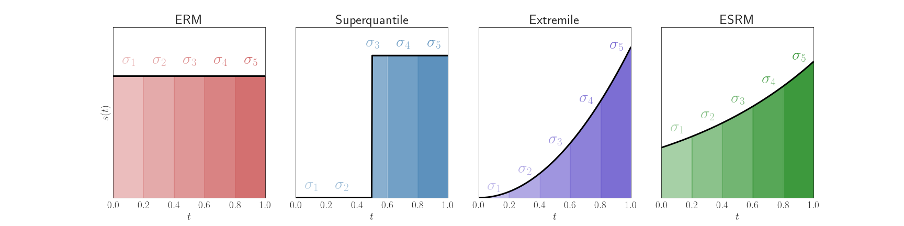

# Stochastic Optimization for Spectral Risk Measures

This repository contains code and experiments for "Stochastic Algorithms for Spectral Risk Measures". We review the necessary background and dependencies and detail how to reproduce the figures in the paper. A lightweight tutorial can be found in `tutorial.ipynb`.

## Background

Spectral risk objectives -- also called $L$-risks -- allow for learning systems to interpolate between optimizing average-case performance (as in empirical risk minimization) and worst-case performance on a task. This code repository implements algorithms that minimize these objectives for linear and multinomial logistic regression problems, handling problems such as non-smoothness and biasedness of standard (sub)gradient estimates. 

We consider in particular optimization problems of the form
$$ \min\_{w \in \mathbb{R}^d} \sum\_{i=1}^n \sigma\_i \ell\_{(i)} (w), $$
in which $\ell_i(w)$ denotes the loss of a model with weights $w \in \mathbb{R}^d$ on data instances $i$, $\ell_{(1)}(w) \leq \ldots \leq \ell_{(n)}(w)$ denotes the *order statistics* of $\ell_1(w), \ldots, \ell_n(w)$, and $\sigma_1 \leq \ldots \leq \sigma_n$ are a set of non-decreasing weights that sum to one. This formulation contains the average $(\sigma_i = 1/n \ \forall i)$ and the maximum $(\sigma_n = 1)$ as special cases. These weights are often defined as an $n$-bin discretization of a continuous density $s$ (called a *spectrum*) defined on $(0, 1)$ with $\sigma_i = \int_{(i-1)/n}^{i/n} s(t) dt$. Examples of spectral risks with their associated $s$ function and $\sigma_i$ weights are plotted below, with the uniform spectrum corresponding to Empirical Risk Minimization (ERM).



## Dependencies

The required software environment can be build and activated with Anaconda/Miniconda using the following.
```
conda env create -f environment.yml
conda activate lrm
```
The environment `lrm` contains the necessary packages and Python version (3.8). We recommend a hardware environment has at least 16GB CPU RAM.

## Reproducing Experimental Results

The experimental results are derived from trajectories of combinations of losses and optimizers (the former of which also depends on the dataset of choice). First, download the data by running:
```
python scripts/download_data.py
```
In order to compute an individual trajectory, one can run
```
python scripts/train.py --dataset <dataset> --objective <objective> --optimizer <optimizer> --l2_reg <l2_reg>
```
where the options for each argument are
- `<dataset>`: `yacht`, `energy`, `concrete`, `simulated`, for regression, and `iwildcam_std` for multiclass classification.
- `<objective>`: `erm`, `superquantile`, `extremile`, `esrm`, `superquantile_lite`, `extremile_lite`, `esrm_lite`, `superquantile_hard`, `extremile_hard`, `esrm_hard`.
- `<optimizer>`: `sgd`, `srda`, `lsvrg`, `lsvrg_uniform`, `slsvrg_l2`, `slsvrg_neg_ent`, `slsvrg_l2_rnd_check`, `slsvrg_neg_ent_rnd_check`.
- `<l2_reg>`: `small`, `medium`, `large`.

For the $\ell^2$ regularization parameter `l2_reg`, `small`, `medium`, and `large` correspond to $\mu = 0.1/n$, $\mu = 1/n$, and $\mu = 10/n$, respectively. The choices for the optimizer parameter `optimizer` correspond to the following settings.

| Algorithm Tag      | Description |
| ----------- | ----------- |
| `sgd`      | Stochastic subgradient method.       |
| `srda`   | Stochastic regularized dual averaging.        |
| `lsvrg`   | LSVRG with non-uniform sampling of $i_t$.        |
| `lsvrg_uniform`   | LSVRG with uniform sampling of $i_t$.       |
| `slsvrg_l2`   | Smoothed LSVRG with $\ell^2$ penalty and $q^* = 0$.    |
| `slsvrg_neg_ent`   | Smoothed LSVRG with negative entropy penalty and $q^* = 0$.        |
| `slsvrg_l2_rnd_check`   | Smoothed LSVRG with $\ell^2$ penalty and $q^* = 1/n$.        |
| `slsvrg_neg_ent_rnd_check`   | Smoothed LSVRG with negative entropy penalty and $q^* = 1/n$.      |

To reproduce the results for a particular objective and all algorithms and regression datasets, we have provided four bash scripts `run_erm.sh`, `run_superquantile.sh`, `run_extremile.sh`, and `run_esrm.sh`, which can be run, for example, by:
```
bash scripts/run_erm.sh
```
The image classification dataset `iwildcam_std` (corresponding to WILDS iWildCam with standardization) can have each of the algorithms run with
```
bash scripts/run_iwildcam.sh
```
and takes ~11 hours on a machine with 128 GB RAM and 32 CPU cores. Please run all of them to get the necessary results for each figure. The scripts default to using `medium` $\ell^2$ regularization, but can be adjusted in line 4 and 7. This scripts also run L-BFGS to compute the minimum value of a dataset-objective pair. This can be done independently with
```
python scripts/lbfgs.py --dataset <dataset> --objective <objective> --l2_reg <l2_reg>
```
All results are saved in the `results/` directory, which is read by the figure-generating notebooks. 

## Reproducing Figures

To reproduce figures from the paper, we run a corresponding self-contained Jupyter notebook. We assume one has already run the scripts `run_erm.sh`, `run_superquantile.sh`, `run_extremile.sh`, `run_esrm.sh`, and `run_iwildcam`, with the `--l2_reg` parameters set to `small`, `medium`, `large`. Figures are all generated by notebooks run from start to finish, indexed below.

| Figure      | Filename |
| ----------- | ----------- |
| 1   | `notebooks/figure-quantile-function.ipynb`, `notebooks/figure-sigma.ipynb`, `notebooks/figure-ot-distance.ipynb`       |
| 2, 9-14, 18   | `notebooks/figure-training-curves.ipynb`       |
| 15-17 |  `notebooks/figure-robustness.ipynb`       |
| 19 |  `notebooks/figure-runtime.ipynb`       |


## Source Code

Optimizers are implemented in `src/optim/algorithms.py`. Tools for data loading/preprocessing and training are located in `src/utils/data.py` and `src/utils/training.py`, respectively.

## Citation

If you find this code useful, or you use it in your research, please cite:
```
@misc{https://doi.org/10.48550/arxiv.2212.05149,
  doi = {10.48550/ARXIV.2212.05149},
  url = {https://arxiv.org/abs/2212.05149},
  author = {Mehta, Ronak and Roulet, Vincent and Pillutla, Krishna and Liu, Lang and Harchaoui, Zaid},
  title = {Stochastic Optimization for Spectral Risk Measures},
  publisher = {arXiv},
  year = {2022},
  copyright = {arXiv.org perpetual, non-exclusive license}
}
```
